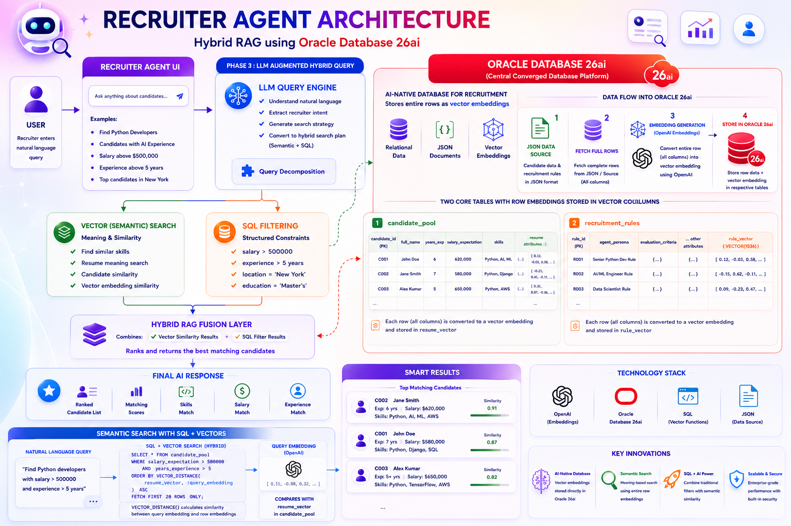

# 🚀 Recruiter Agent — Hybrid RAG Recruitment System

> Combining OpenAI Embeddings and Oracle Database 26ai Vector Search for intelligent candidate discovery.

## 🏗️ Architecture

The architecture diagram below illustrates the complete workflow.



---

## 📌 Overview

This project demonstrates how to build a recruiter assistant that combines traditional SQL filtering with semantic vector search using **Oracle Database 26ai**.

The system ingests candidate and recruitment-rule data from JSON files, stores the data in Oracle tables, generates embeddings using OpenAI, and saves those embeddings in Oracle `VECTOR` columns for semantic similarity search.

Unlike traditional recruitment systems that rely only on structured filters such as:

- Years of Experience
- Salary Expectation
- Skills
- Location

this system supports natural language queries like:

> *"Find senior Python developers with AI experience and salary expectations below ₹20 LPA."*

The application combines **SQL Filtering**, **Vector Similarity Search**, **OpenAI Embeddings**, and **Oracle Database 26ai VECTOR Columns** to identify and rank the most relevant candidates.

---

## 💡 Key Concepts

### Hybrid Search

The application combines two search approaches:

**Structured SQL Search**
```sql
salary_expectation <= 2000000
AND years_experience >= 5
```

**Semantic Vector Search**
```text
Find candidates with strong backend experience and AI knowledge.
```

User queries are converted into embeddings and compared against stored vectors using Oracle Vector Search.

---

## 🗄️ Data Storage

The system stores data in two Oracle tables.

### `candidate_pool`

Stores candidate profiles.

| Column               | Description                          |
|----------------------|--------------------------------------|
| `candidate_id`       | Unique identifier for the candidate  |
| `full_name`          | Candidate's full name                |
| `years_experience`   | Total years of experience            |
| `salary_expectation` | Expected salary                      |
| `skills`             | List of skills                       |
| `summary`            | Short profile summary                |
| `resume_vector`      | Vector embedding of the full profile |

**How `resume_vector` is generated:**

```text
Candidate Record  →  OpenAI Embedding Model  →  Vector Embedding  →  resume_vector
```

---

### `recruitment_rules`

Stores recruiter personas and evaluation criteria.

| Column               | Description                              |
|----------------------|------------------------------------------|
| `rule_id`            | Unique identifier for the rule           |
| `agent_persona`      | Recruiter persona description            |
| `evaluation_criteria`| Criteria used to evaluate candidates     |
| `rule_vector`        | Vector embedding of the full rule        |

**How `rule_vector` is generated:**

```text
Recruitment Rule  →  OpenAI Embedding Model  →  Vector Embedding  →  rule_vector
```

---

## 📁 Project Structure

```text
.
├── data_ingestion
│   ├── fetch_and_transform.py
│   └── insert_data.py
│
├── data_mgment
│   ├── create_table.py
│   ├── empty_table.py
│   └── verify_table.py
│
├── query_llm_logic
│   ├── __init__.py
│   ├── active_persona.py
│   ├── candidate_filter.py
│   └── generate_recommendation.py
│
├── connection_db.py
├── hr_data.json
├── main.py
├── sample_search_query.py
├── data_insert.ipynb
├── data_management.ipynb
├── hybrid_qqq.ipynb
├── requirements.txt
└── README.md
```

---

## ☁️ Oracle Setup

### Step 1 — Create an Oracle Cloud Account

Create an Oracle Cloud account and provision an **Oracle Database 26ai** instance.

### Step 2 — Download Wallet

Download the database wallet from Oracle Cloud.

```text
Oracle Cloud  →  Database  →  DB Connection  →  Download Wallet
```

Extract the wallet and place it inside the project directory:

```text
Wallet_xxxxx/
├── cwallet.sso
├── sqlnet.ora
├── tnsnames.ora
└── ...
```

### Step 3 — Configure Database Connection

Update the Oracle credentials inside `connection_db.py`:

- Username
- Password
- Wallet Location
- DSN

---

## ⚙️ Installation

**Python Version:** `3.12`

```bash
pip install -r requirements.txt
```

---

## 🛠️ Database Initialization

```bash
# Create tables
python data_mgment/create_table.py

# Verify tables
python data_mgment/verify_table.py
```

---

## 📥 Data Ingestion

```bash
python data_ingestion/insert_data.py
```

The ingestion pipeline:

```text
JSON Data  →  OpenAI Embeddings  →  Oracle Database 26ai  →  VECTOR Columns
```

---

## ▶️ Running the Application

```bash
python main.py
```

---

## 📓 Development Notebooks

The following notebooks were used during experimentation and prototyping before the logic was migrated into production Python modules:

```text
data_insert.ipynb
data_management.ipynb
hybrid_qqq.ipynb
```

---

## 🧰 Technologies Used

| Technology             | Purpose                          |
|------------------------|----------------------------------|
| Oracle Database 26ai   | Primary data store               |
| Oracle Vector Search   | Semantic similarity search       |
| OpenAI API             | Embedding generation             |
| Python 3.12            | Application logic                |
| SQL                    | Structured filtering             |
| JSON                   | Data ingestion format            |

---

## ✅ Features

- ⚡ Hybrid SQL + Vector Search
- 🤖 OpenAI Embeddings
- 🗃️ Oracle VECTOR Columns
- 🎭 Recruiter Persona Matching
- 🏆 Candidate Ranking
- 🔍 Semantic Similarity Search
- 💬 Natural Language Candidate Discovery

---

## 👤 Author

**Paras Patel**
